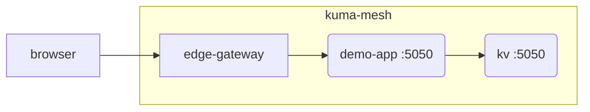

# Kuma Counter Demo

[](https://insomnia.rest/run/?label=kuma-counter-demo&uri=https%3A%2F%2Fgithub.com%2Fkumahq%2Fkuma-counter-demo%2Fblob%2Fmain%2Fopenapi.yaml)

[![][kuma-logo]][kuma-url]

[](https://github.com/kumahq/kuma/blob/master/LICENSE)
[](https://join.slack.com/t/kuma-mesh/shared_invite/zt-1rcll3y6t-DkV_CAItZUoy0IvCwQ~jlQ)
[](https://twitter.com/intent/follow?screen_name=KumaMesh)

Welcome to a sample application that demonstrates the [Kuma](https://github.com/kumahq/kuma) service mesh in action. Kuma is designed to work across Kubernetes and VMs environments, with support for multi-zone deployments across many different clusters, data centers, and clouds.

To learn more about Kuma, see [the Kuma website](https://kuma.io).

Kuma is a CNCF Sandbox project.

## Introduction

The application consists of the same app instantiated differently to simulate 2 services:

- A `demo-app` service that presents a web application that allows us to increment a numeric counter
- A `kv` service which simulates a database.




The `demo-app` service presents a browser interface that listens on port `5050`.

You can set the zone key on the kv `curl -v -XPOST -d '{"value":"zone-1"}' localhost:5050/api/key-value/zone -H 'content-type: application/json'` where `localhost:5050` is your kv service.

## Run the application

Follow the [getting-started](https://kuma.io/docs/latest/quickstart/kubernetes-demo/) on the Kuma docs.

Or you can play with skaffold on your already running k8s cluster:

```shell
make skaffold/dev
```
This will demo an entire stack on top of Kuma.

You can also just pick which demo you want with:

```shell
make demo/list
```

Which will return something like:

```shell
$ make demo/list
# Run the demo application without Kuma
kubectl apply -k kustomize/base
# Run the demo application with Kuma
kubectl apply -k kustomize/overlays/000-with-kuma
# Run the demo application with Kuma, mTLS and Mesh Traffic Permission
kubectl apply -k kustomize/overlays/001-with-mtls
# Run the demo application with Kuma, mTLS, Mesh Traffic Permission and a Gateway
kubectl apply -k kustomize/overlays/002-with-gateway
```

To apply these manifests directly, you should have a running k8s cluster and Kuma already installed.

```shell
helm install kuma kuma/kuma --create-namespace --namespace kuma-system
```

You can cleanup a demo by doing: `kubectl delete -k k8s/overlays/002-with-gateway`

### Environment Variables

We can configure the following environment variables when running `demo-app`:

* `KV_URL`: The address at which to contact the service. 
* `APP_VERSION`: Lets you change the version number displayed in the main page of `demo-app` and the header `x-demo-app-version` to all responses.

The `APP_VERSION` environment variables are handy when we want to create different versions of `demo-app` and get immediate visual feedback when routing across them.

### Debugging

To debug things we strongly recommend using: [`netshoot`](https://github.com/nicolaka/netshoot):

```shell
kubectl debug  demo-app-68784dc9d7-rjxgx -n kuma-demo -it --image=nicolaka/netshoot
```

## Modifying responses

### Adding delay to response

To add delay to response you need to set header `x-set-response-delay-ms`. Example:

```shell
curl localhost:5050/api/counter -XPOST -H "x-set-response-delay-ms: 5000"
```

### Enforcing response status code

To enforce response status code you need to set header `x-set-response-status-code`. Example:

```shell
curl localhost:5050/api/counter -XPOST -H "x-set-response-status-code: 503"
```

[kuma-url]: https://kuma.io/
[kuma-logo]: https://kuma-public-assets.s3.amazonaws.com/kuma-logo-v2.png
